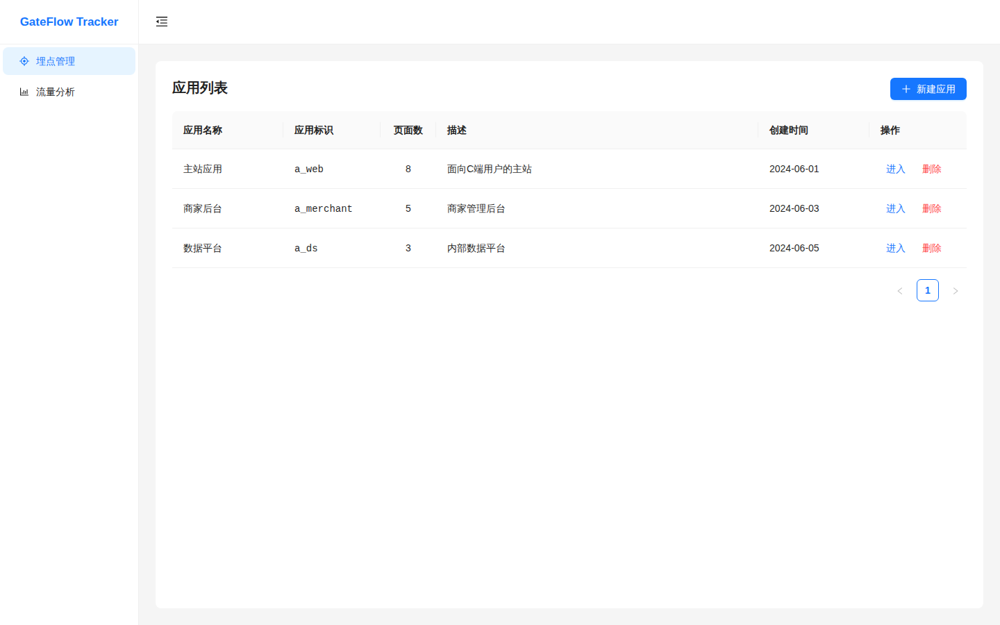
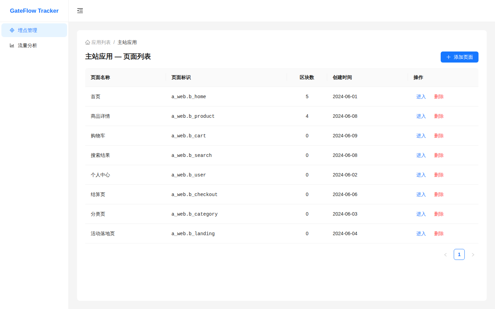
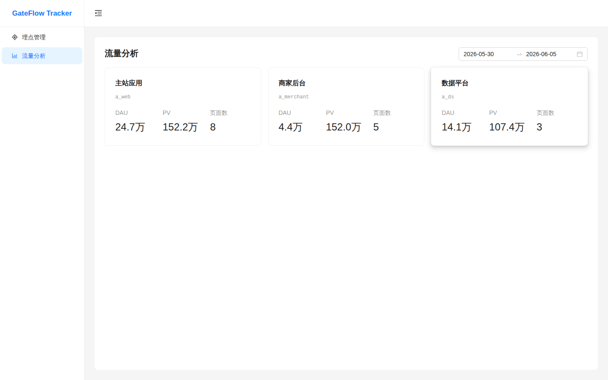
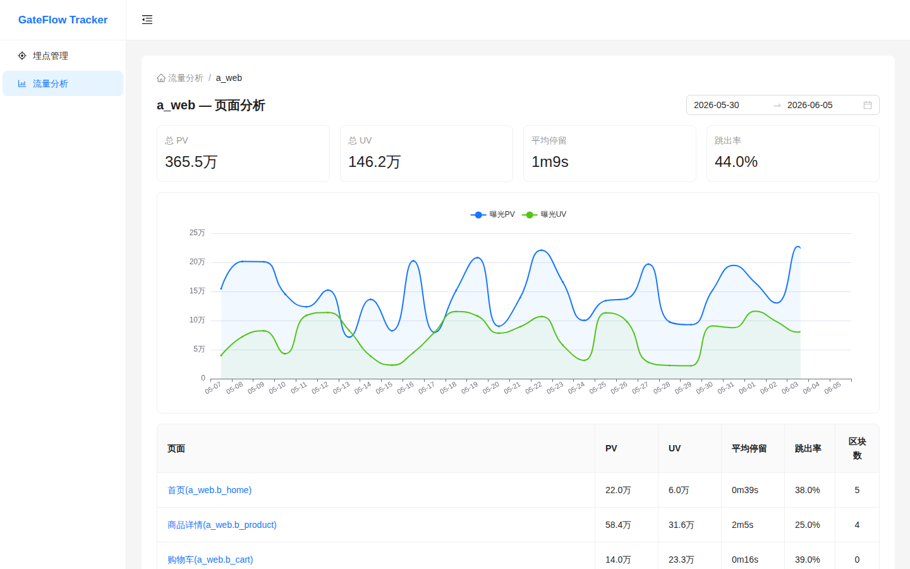
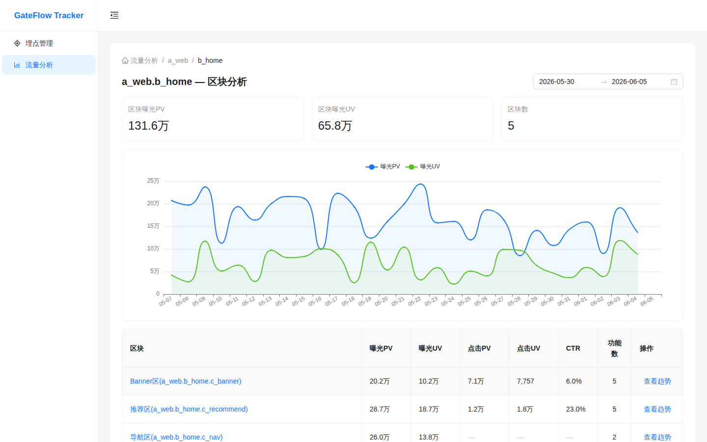
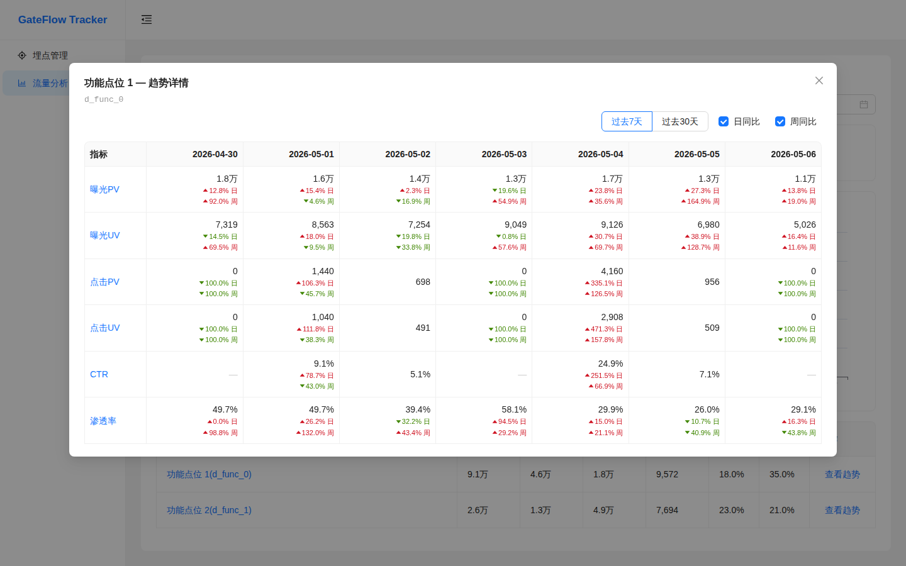

# Tracker System — 埋点采集&流量分析系统

GateFlow 用户行为数据采集平台。独立部署、全维度采集、高性能管道，为 AB 实验与数据分析提供可靠的事件数据基础。

## 系统概览

Tracker System 负责全站用户行为数据的采集、处理、存储和分析。与 AB 实验系统独立部署，通过 `user_id` 在 ClickHouse 层关联。

```
客户端                                       服务端                              存储与分析
┌──────────────────────────┐      ┌──────────────────────────────┐      ┌──────────────────┐
│  Tracker SDK              │      │  Tracker Service (Spring Boot) │      │  ClickHouse       │
│  ├─ Page / Click          │ POST │  ├─ 格式校验                   │      │  ├─ 事件分析       │
│  ├─ Exposure / Scroll     │─────▶│  ├─ Redis 去重                │─────▶│  ├─ 会话分析       │
│  ├─ Stay / Error          │      │  ├─ 数据增强 (UTM/UA/Geo)     │      │  ├─ SPM 路径分析   │
│  └─ 离线队列 (localStorage)      │  └─ 熔断 → DLQ 死信队列       │      │  └─ 归因分析       │
└──────────────────────────┘      └──────────────────────────────┘      └──────────────────┘
```

## 项目结构

```
tracker-system/
├── tracker-sdk/          # 客户端 TypeScript 埋点 SDK (@gate-flow/tracker-sdk)
│   └── src/
│       ├── collectors/   # 采集器: Page / Click / Exposure / Scroll / Stay / Error / Session
│       ├── queue/        # 离线事件队列 (localStorage + 内存)
│       ├── sender/       # 批量上报调度器
│       ├── tracker/      # 主控 Tracker 类
│       ├── integration/  # GateFlow AB 实验平台集成
│       ├── devtools/     # 浏览器 DevTools 调试面板
│       └── types/        # TypeScript 类型定义
│
├── backend/              # Java 后端服务 (git submodules)
│   ├── tracker-service/  # 事件采集服务 (Spring Boot + ClickHouse + Redis + Kafka)
│   └── tracker-admin/    # 管理后台服务 (Spring Boot)
│
├── docs-site/            # VitePress 文档站点
│   ├── guide/            # 产品指南 (面向 PM / 运营)
│   ├── dev/              # 技术架构文档 (面向开发者)
│   └── knowledge/        # 团队内部知识沉淀
│
└── docs/                 # Markdown 设计文档
```

## 核心特性

- **全维度采集** — 覆盖页面浏览、元素点击、元素曝光、滚动深度、停留时长、JS 错误、自定义事件等 7 种事件类型
- **SPA 友好** — 拦截 History API 自动捕获 SPA 路由切换，IntersectionObserver 实现曝光追踪低开销
- **离线可靠性** — 客户端 localStorage 队列 + 批量发送 + 重试机制，页面关闭前 flush，数据不丢失
- **服务端高可用** — Redis 去重、熔断保护 (Resilience4j)、DLQ 死信队列 (7天 TTL) 定时重放
- **高性能写入** — ClickHouse MergeTree 引擎，Materialized View 自动聚合，90 天 TTL 自动清理
- **SPM 标准化埋点** — 四级路径规范 `a.b.c.d`，统一命名，便于跨团队协作
- **归因分析** — UTM 渠道归因、首次/末次触点归因，多维度来源分析
- **DevTools 调试** — 内置浏览器调试面板，实时事件日志、字段校验、元素高亮

## 快速开始

### 0. 一键启动全栈（推荐）

克隆仓库及子模块后，单条命令拉起完整系统（MySQL · ClickHouse · Redis · Kafka · 采集服务 · 管理后台 · 前端）：

```bash
git submodule update --init --recursive
docker compose up -d --build
```

启动后访问：

| 服务 | 地址 | 说明 |
|------|------|------|
| 管理后台前端 | http://localhost:8080 | React 控制台（nginx 提供，已反代 API） |
| 管理后台 API | http://localhost:8082 | tracker-admin（Swagger: `/swagger-ui.html`） |
| 事件采集服务 | http://localhost:8088 | tracker-service（埋点上报 `POST /api/v1/collect`） |
| Kafka（宿主机） | localhost:29092 | 容器内部使用 `kafka:9092` |

> 仅需基础设施（数据库/中间件）用于本地开发后端时，可改用
> `docker compose -f docker/docker-compose.infra.yml up -d`。

### 1. 安装 Tracker SDK

```bash
npm install @gate-flow/tracker-sdk
```

```typescript
import { createTracker } from '@gate-flow/tracker-sdk'

const tracker = createTracker({
  appId: 'your-app-id',
  serverUrl: 'https://tracker.example.com/api/v1/collect',
  autoTrack: {
    pageView: true,
    click: true,
    exposure: true,
    scroll: true,
    stay: true,
    error: true,
  },
})
```

### 2. 启动文档站点

```bash
cd docs-site
npm install
npm run dev          # VitePress dev server
```

### 3. 克隆后端服务

```bash
git submodule update --init --recursive
```

## 后端子模块

后端服务通过 git submodule 引入，需单独克隆：

| 服务 | 说明 | 仓库 |
|------|------|------|
| `backend/tracker-service` | 事件采集服务 — 接收、校验、去重、增强、写入 ClickHouse | [HiCooper/tracker-service](https://github.com/HiCooper/tracker-service) |
| `backend/tracker-admin` | 管理后台服务 — 事件管理、SPM 管理、行为分析 | [HiCooper/tracker-admin](https://github.com/HiCooper/tracker-admin) |

## 技术栈

| 层次 | 技术 |
|------|------|
| **客户端 SDK** | TypeScript · tsup · Vitest |
| **采集服务** | Java · Spring Boot · ClickHouse · Redis (Cluster) · Kafka |
| **管理后台** | Java · Spring Boot |
| **文档站点** | VitePress · Mermaid |
| **运维** | Docker Compose |

## 文档

在线文档站点包含完整的产品指南、技术架构和内部知识库。

| 章节 | 面向 | 内容 |
|------|------|------|
| [产品指南](https://github.com/HiCooper/tracker-system/tree/main/docs-site/guide/) | PM / 运营 | 采集能力、SPM 规范、使用流程 |
| [技术架构](https://github.com/HiCooper/tracker-system/tree/main/docs-site/dev/) | 开发者 | 架构设计、事件管道、数据模型、SDK 集成、部署 |
| [内部资料](https://github.com/HiCooper/tracker-system/tree/main/docs-site/knowledge/) | 团队成员 | 服务地址、ADR、踩坑经验、外部参考 |

## 采集维度

| 维度 | 核心指标 | 采集方式 |
|------|---------|---------|
| **页面级** | PV / UV、跳出率、停留时长 | SPA 路由监听 · visibilitychange |
| **元素级** | 曝光率、点击率、转化漏斗 | Intersection Observer · 事件委托 |
| **路径分析** | 页面序列、关键节点 | 会话级序列聚合 |
| **归因分析** | 渠道贡献、首次/末次触点 | UTM 参数 · 时间窗口 |

## 管理后台

基于 React + TypeScript + Ant Design 5 构建的埋点管理与流量分析平台。

### 埋点管理 — SPM 元数据逐级创建





### 流量分析 — 层层下钻









## License

Private — GateFlow internal project.
