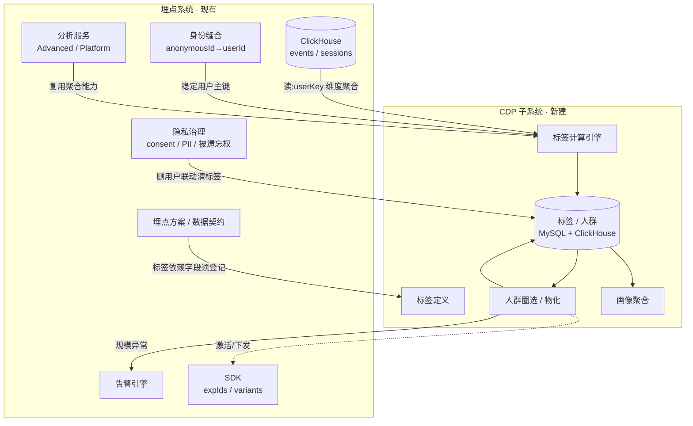

# CDP 子系统设计与集成

> 本文为 **CDP(Customer Data Platform,客户数据平台)** 作为**独立子系统**的设计与集成说明。
> 重点不在 CDP 内部实现细节,而在**它与当前埋点系统的交互关联**:依赖哪些已建能力、从哪里取数、
> 在哪些点上耦合、对外暴露什么契约。CDP 的内部引擎(标签计算 / 人群圈选)留待独立专题开发。

## 0. 定位与边界

| 能力 | 归属 | 现状 |
|---|---|---|
| 事件采集 / 会话 / 身份缝合 / 隐私治理 | **埋点系统(现有)** | ✅ 已上线 |
| 事件分析(流量/漏斗/留存/路径/体验/看板) | **埋点系统(现有)** | ✅ 已上线 |
| **标签(Tag)定义与计算** | **CDP(新子系统)** | ❌ 待建 |
| **人群(Crowd/Segment)圈选与物化** | **CDP(新子系统)** | ❌ 待建 |
| **用户画像(Portrait)聚合** | **CDP(新子系统)** | ❌ 待建(前端就绪) |
| **人群激活 / 下发(Activation)** | CDP × 实验/SDK | ❌ 远期 |

一句话:**埋点系统是 CDP 的数据底座与身份底座;CDP 在其上做"以用户为中心"的标签化与人群化。**

---

## 1. 交互关联总览

---

## 2. 关键集成点(本文重点)

### 2.1 数据来源:ClickHouse 明细 + app 维度
- CDP 的统计型标签与人群计算,**只读** 埋点系统的 ClickHouse `gateflow_tracker.events` / `sessions`。
- **多租户隔离**:已为 `events` 增加 `app_code` 列(= 采集 `clientId` = 契约 key),CDP 的标签/人群**必须带 `app_code` 维度**,避免跨 app 串号。
- 约定:CDP 不直接写 `events`,只**派生**标签/人群到自有存储(见 §4),保持采集链路单向、可重放。

### 2.2 身份解析:CDP 的用户主键地基(强依赖)
- CDP 以"用户"为中心,而事件里 `user_id` 与 `anonymous_id` 是两列。**必须复用埋点系统已建的身份缝合**:
  统一用户口径 `userKey = if(user_id != '', user_id, anonymous_id)`(与分析服务一致)。
- 登录前后行为能否归并到同一用户,直接决定标签/人群的准确性 —— 这正是身份缝合(`$identify` + 回填)的价值兑现点。
- **建议**:CDP 标签计算统一走 `userKey`;后续若上线服务端身份图(并查集),CDP 直接消费解析后的 `resolved_user_id`。

### 2.3 隐私合规:删除与同意必须联动(强约束)
- **被遗忘权**:埋点系统已提供 `DELETE /api/v1/privacy/users/{userId}`(删 CH events/sessions)。
  CDP **必须订阅/联动**该删除 —— 删用户时同步清除其标签命中与人群成员,否则合规留有死角。
- **同意门控 / PII 掩码**:CDP 标签不得使用被 `consent=false` 剥离或被掩码/哈希的 PII 原文。
  画像维度(gender/age/region 等)若涉及敏感属性,须遵循同一套 consent 策略。
- **审计**:CDP 的标签/人群创建、删除属管理操作,应纳入已建的审计拦截器(`/api/v1/**` 变更类自动入审计)。

### 2.4 数据契约:标签依赖字段须在埋点方案登记
- 统计型标签依赖具体事件/属性(如"近 30 天下单 ≥ 3 次"依赖 `purchase` 事件)。
- 这些事件/属性**应在埋点方案(Plan)中登记并经契约校验**,否则标签会因 schema 漂移而静默失真。
- **建议**:CDP 标签定义引用 Plan 中的 `eventKey` / `propKey`,形成"契约 → 标签 → 人群"的可追溯链路。

### 2.5 复用分析能力,避免重复造轮子
- 标签计算的底层聚合(留存、活跃、渠道、行为序列)与现有分析服务高度重叠:
  - `AdvancedAnalysisService`(漏斗/留存/路径)、`PlatformDataService`(渠道/页面/核心指标)。
- **建议**:CDP 标签引擎以这些服务/同款 ClickHouse 查询为基础,只新增"按用户产出标签值"的物化层。

### 2.6 告警联动:人群规模异常
- 已建的告警引擎(`tracker_alert_rule` + `@Scheduled` 评估)可扩展一类规则:**人群规模骤变**(crowd size drop/spike)。
- 复用同一套 `AlertEvaluator` + 通知通道(webhook),无需另起告警体系。

### 2.7 激活 / 下发(远期)
- 人群可作为**实验受众**或**SDK 下发标签**的输入:SDK 事件已带 `expIds` / `variants` 字段,GateFlow 集成已有 userId/实验标签通道。
- 约定方向:CDP 产出人群 → 实验/特征开关平台消费 → SDK 下发;埋点回流命中事件,形成闭环。

---

## 3. 对外契约(前端已就绪,作为后端实现的目标)

前端的 CDP/画像页面、store、API **均已实现**,缺的是后端。以下是后端需对齐的契约(字段见各 service):

### 3.1 标签 / 人群(`/api/v1/cdp`)
| 方法 | 端点 | 说明 |
|---|---|---|
| GET | `/v1/cdp/tags?search&category` | 标签列表(`TagDef`:name/type(rule\|computed)/userCount/coveragePct/rule…) |
| GET | `/v1/cdp/tags/{id}` | 标签详情 |
| POST | `/v1/cdp/tags` | 创建标签(规则 / 统计) |
| DELETE | `/v1/cdp/tags/{id}` | 删除标签 |
| GET | `/v1/cdp/crowds` | 人群列表(`CrowdDef`:name/userCount/baseTags/logic(AND\|OR)/status…) |
| POST | `/v1/cdp/crowds` | 创建人群(按标签组合) |
| DELETE | `/v1/cdp/crowds/{id}` | 删除人群 |

### 3.2 画像(`/api/v1/portrait`)
| 方法 | 端点 | 说明 |
|---|---|---|
| GET | `/v1/portrait/basic` | 基础画像(gender/age/region/device/network/activePeriod 维度占比) |
| GET | `/v1/portrait/tags` | 标签概览(totalTags/coverageRate/autoTags/customTags + Top 标签) |
| GET | `/v1/portrait/crowds` | 人群概览(totalCrowds/maxCrowdSize/todayNew/running + 人群列表) |

> 注:`device/network/activePeriod` 可直接从 `events` 派生(已有 device_type/os/utm 等);
> `gender/age/region` 属业务侧人口属性,埋点系统不采集,需 CDP 从外部用户主数据接入(标注来源)。

---

## 4. 建议数据模型(CDP 自有存储)

> 原则:**定义存 MySQL,计算结果存 ClickHouse**;CDP 不污染埋点采集链路。

- `cdp_tag_def`:标签定义(id、name、type、category、`rule`(规则 DSL / SQL 片段)、`app_code`、depends_on(Plan 事件/属性)、status、updated_at)。
- `cdp_crowd_def`:人群定义(id、name、`base_tags`(标签组合)、`logic` AND/OR、`app_code`、status、updated_at)。
- `cdp_tag_value`(ClickHouse):`(app_code, user_key, tag_id, value, computed_at)` —— 标签计算物化,按 `@Scheduled` 刷新。
- `cdp_crowd_member`(ClickHouse):`(app_code, crowd_id, user_key, joined_at)` —— 人群物化,供画像/激活查询与规模统计。

计算调度:复用项目已有的 `@Scheduled` 模式(参考 `SessionCleanupTask` / `AlertEvaluationJob`),周期性按定义重算标签/人群。

---

## 5. 分期路线建议

| 期 | 范围 | 依赖 |
|---|---|---|
| **P0** | 标签定义 CRUD(`/v1/cdp/tags`)+ 统计型标签计算(基于 events 聚合,按 userKey 物化) | 身份缝合、app 维度 |
| **P1** | 人群圈选(`/v1/cdp/crowds`,标签组合 AND/OR)+ 人群物化 + 规模统计 | P0 |
| **P2** | 画像聚合(`/v1/portrait/*`):可派生维度直查 events,人口属性接外部主数据 | P0/P1 |
| **P3** | 隐私联动(删用户清标签/人群)、人群规模告警、审计接入 | 隐私/告警(已建) |
| **P4** | 激活 / 下发(实验受众、SDK 标签),与 GateFlow 实验通道打通 | 远期 |

---

## 6. 风险与约束

- **身份准确性**:CDP 质量上限取决于身份缝合覆盖率;`$identify` 上报缺失会拉低用户级标签准确性。
- **口径一致**:CDP 必须复用 `userKey` 与 `app_code` 口径,避免与现有分析模块产生"两套数"。
- **合规死角**:删除/同意若不联动 CDP,将留下合规风险 —— P3 必须随人群上线一起做,而非事后补。
- **不污染采集链路**:CDP 只读 events、派生到自有存储,严禁回写 events 或在采集热路径同步计算标签。
- **人口属性来源**:gender/age/region 等非埋点采集字段需明确外部来源与合规授权,前端画像对应卡片在数据缺位时应标注"未接入"。

---

> 落地时,请在 `.claude/decisions/` 记录关键选择(标签规则 DSL、物化存储选型、刷新频率等),并将本文随实现演进更新。
