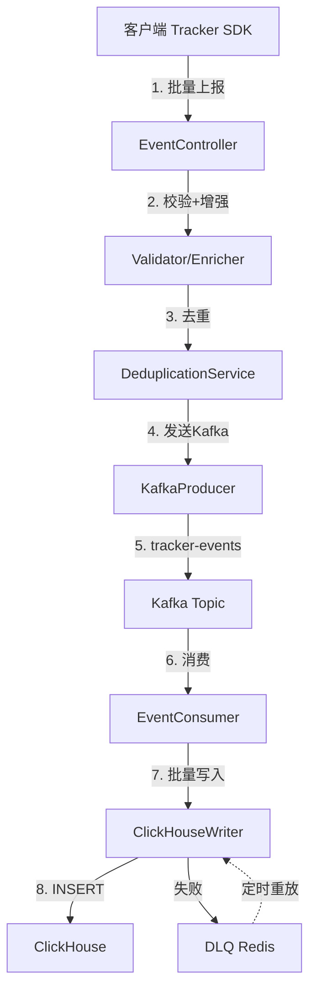

# 事件管道

本文档详细介绍 Tracker 埋点系统的事件采集、传输、存储和处理架构。

## 整体架构



**数据流说明**：
1. 客户端 Tracker SDK 批量上报事件
2. EventController 接收并校验事件格式
3. DeduplicationService 基于 eventId 去重
4. KafkaProducer 异步发送到 Kafka
5. EventConsumer 批量消费事件
6. ClickHouseWriter 批量写入 ClickHouse
7. 写入失败的事件进入 DLQ 死信队列
8. DLQ 定时重放恢复事件

## 核心组件

| 组件 | 职责 |
|------|------|
| EventController | REST API 接收事件，限流保护 |
| EventValidator | 格式校验，拒绝非法事件 |
| DeduplicationService | Redis SET NX 去重 |
| EnrichmentService | UTM/UA 信息增强 |
| KafkaProducer | 异步发送事件到 Kafka |
| EventConsumer | 批量消费 Kafka 事件 |
| ClickHouseWriter | 带熔断保护的批量写入 |
| DLQService | 死信队列存储与重放 |

## 事件接收 API

**POST /api/v1/collect**

处理流程：

```
接收请求 → 限流检查 → 逐事件处理 → 返回统计
              │
              ├─ 校验失败 → DLQ
              ├─ 去重命中 → skip
              └─ 通过 → 数据增强 → ClickHouse写入
                           │
                           └─ 写入失败 → DLQ
```

响应格式：

```json
{
  "code": 200,
  "message": "success",
  "data": {
    "accepted": 10,
    "duplicate": 1,
    "rejected": 0
  }
}
```

## 请求格式

```json
{
  "events": [
    {
      "eventId": "evt_123456",
      "eventType": "exposure",
      "userId": "user_001",
      "timestamp": 1704067200000,
      "platform": "ios",
      "deviceId": "device_abc",
      "sessionId": "sess_xyz",
      "experimentTags": [
        {
          "expId": "exp_homepage_v1",
          "variant": "treatment",
          "layer": "layer_001"
        }
      ],
      "properties": {
        "page": "home",
        "position": 1
      }
    }
  ]
}
```

## 批量处理

### 客户端

| 配置项 | 默认值 | 说明 |
|--------|--------|------|
| `batch.maxSize` | 50 | 积累 50 条后批量发送 |
| `batch.interval` | 2000ms | 每 2 秒检查一次 |

### 服务端

| 配置项 | 默认值 | 说明 |
|--------|--------|------|
| `batch.size` | 100 | 批量写入大小 |
| `batch.interval` | 2000ms | 批量间隔 |

## 可靠性保障

| 机制 | 实现 | 说明 |
|------|------|------|
| 限流保护 | Token Bucket | 防止流量冲击 |
| 格式校验 | JSR-303 | 拒绝非法事件 |
| 去重 | Redis SET NX | 5分钟窗口去重 |
| 熔断 | Resilience4j CircuitBreaker | 50%失败率触发 |
| DLQ | Redis (7天TTL) | 失败事件持久化 |
| 客户端离线队列 | IndexedDB | 网络断开暂存 |

## 配置

```yaml
tracker:
  batch:
    size: 100
    interval: 2000
  rate-limit:
    max-per-second: 10000
    burst: 20000
  dedup:
    window-minutes: 5

spring:
  kafka:
    bootstrap-servers: localhost:9092
    producer:
      acks: all
      retries: 3
    consumer:
      group-id: tracker-consumer
      auto-offset-reset: earliest
```
