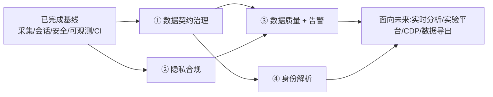

# 平台演进路线图（Roadmap）

> 本文记录 Tracker System 从「可上线的采集系统」迈向「专业级 / 生产级 / 面向未来的埋点平台」的演进规划。
> 路线图基于对全栈代码的深度评审得出,每项均说明**现状问题 → 目标 → 方案 → 分期 → 验收**。

## 已完成基线（生产就绪)

在进入下列演进项之前,系统已完成并合并以下生产基线(详见各仓库 PR 与 `.claude/decisions/`):

- **采集管道正确性**:Redis 命名空间修复、ClickHouse 写入(UTC `DateTime64` + JSON properties)、启用 Kafka 持久化路径 + 同步兜底、统一 DLQ、迁移 fail-fast。
- **会话态迁 Redis(结构修正 A)**:活跃会话态由 ClickHouse 读-改-写 + JVM 锁,改为 Redis 原子计数,跨副本正确;超时一次性落 ClickHouse。
- **分析统一 ClickHouse(结构修正 B)**:弃用从无写入的 MySQL 聚合表,分析页直查 ClickHouse。
- **安全基线**:JWT 密钥强制、删除明文默认凭据、RBAC、WebSocket 握手鉴权、CORS 收敛、**管理操作审计日志**。
- **可观测性**:Prometheus 业务指标(accept/dup/reject/DLQ/去重命中率)、真实健康探针(503 降级)、K8s liveness/readiness、**跨服务请求关联 ID(X-Request-Id)**、监控页接真实数据。
- **工程化**:三仓库 GitHub Actions CI(含 ClickHouse Testcontainers 集成 job)。

下列四项是把「采集工具」升级为「埋点平台」的关键能力。

---

## 总览

| 优先级 | 能力 | 性质 | 复用现有资产 |
|:---:|---|---|---|
| **P0** | ① 数据契约治理 + 入口校验 | 平台护城河 | 埋点方案(Plan)工作流 |
| **P0** | ② 隐私合规与数据治理 | 企业准入红线 | EnrichmentService / Plan 字段 |
| **P1** | ③ 数据质量监控 + 告警引擎 | 数据可信 | Monitor 子系统 / Prometheus 指标 |
| **P1** | ④ 身份解析(Identity Stitching) | 分析正确性 | userId / anonymousId |

---

## ① 数据契约治理 + 入口端 Schema 校验

**现状问题**
采集服务 `EventController.validateEvent` 仅校验 `eventId/eventType/timestamp` 非空,任何字段/任何事件类型都照单全收。这正是「SDK ↔ 服务端契约漂移」反复出现的根因。`tracker-admin` 已有一套埋点方案(Plan)审批工作流,但**方案与实际采集完全脱节**——审批通过的 schema 从不参与入口校验。

**目标**
以「事件即契约」为核心:埋点方案上线即编译为版本化 schema,采集入口按 schema 校验,不合规事件被**隔离**(而非静默丢弃),并持续监测 schema 漂移。对标 Snowplow Iglu / Avo / RudderStack Tracking Plan。

**方案**
- `tracker-admin`:Plan `goOnline` 时把事件定义编译成版本化 JSON Schema,发布到 Redis(`tracker:schema:{appId}`),并提供手动发布端点。
- `tracker-service`:新增 `SchemaRegistry`(Redis + 本地缓存)+ `EventValidator`,入口按 `app + eventType + version` 校验:
  - **monitor 模式**(默认,非破坏):违规事件仍接收,但记 `tracker.events.schema_violation` 指标;
  - **enforce 模式**:违规事件进隔离区(DLQ reason=`schema_violation`),计入 rejected;
  - 无注册 schema 的 app → 直通。
- 监控页新增「Schema 漂移」卡片(未登记事件/字段 Top N)。

**分期**
1. 校验引擎 + 入口拦截 + 指标(monitor 默认) — *tracker-service*
2. Plan 编译 + 发布 — *tracker-admin*
3. 漂移可视化 + enforce 灰度 — *前端 + 配置*

**验收**
- 违规事件被打点/隔离,合规事件正常入库;
- 切到 enforce 后,未登记事件不进主表;
- 单测覆盖校验规则 + Redis 契约,Testcontainers 覆盖端到端。

---

## ② 隐私合规与数据治理（PII / 同意 / 留存 / 被遗忘权)

**现状问题**
事件中的 `userId`、IP、User-Agent 直接落 ClickHouse,`EnrichmentService` 解析 UA 但**无任何脱敏或同意校验**;留存仅靠 ClickHouse 90 天 TTL;**没有被遗忘权删除、没有 consent gating、没有 PII 字段识别与掩码**。

**目标**
满足 GDPR / CCPA / 中国《个人信息保护法(PIPL)》的企业级合规基线,作为 ToB 采购的硬门槛。

**方案**
- **同意管理**:SDK 上报携带 `consent` 标记;采集端对未授权事件仅保留匿名维度并剥离 PII。
- **PII 治理**:Plan 中给字段标注 `pii: true`;`EnrichmentService` 对 PII 做掩码/哈希(IP 截断、邮箱/手机号哈希)。
- **被遗忘权**:`tracker-admin` 新增 `DELETE /api/v1/privacy/users/{id}` → 对 ClickHouse 异步 `ALTER TABLE ... DELETE WHERE user_id=`,并记审计。
- **留存策略**:按 app / 数据类型可配 TTL,替代全局 90 天。

**分期**
1. PII 标注 + 掩码(采集端) 2. 同意 gating 3. 被遗忘权 + 可配留存

**验收**
- PII 字段落库前被掩码;未授权事件无 PII;
- 删除请求后对应 user 数据在 CH 中消失且留审计痕迹。

---

## ③ 数据质量监控 + 告警引擎

**现状问题**
监控页已接真实数据,但 `alerts/rules`、`quality/run`、`quality/reports` 仍是**空壳端点**。当某个 App 因代码改动导致埋点打挂、事件量骤降时,**系统毫无感知**——这是埋点平台最致命的盲区:坏的不是宕机,而是「数据静默地错了」。

**目标**
从「存数据」升级为「保证数据可信」:事件量异常告警、错误率突增告警、数据新鲜度 SLO、字段空值率劣化告警。

**方案**
- **异常检测**:`@Scheduled` job 对比各 app/事件「近 1h vs 历史同期」,跌幅超阈值(同比/环比 + 3σ)触发告警。
- **告警引擎**:`tracker_alert_rule` 表 + 规则求值 + 通知渠道(Webhook / 邮件 / 钉钉)。
- **数据质量检查**:把 `quality/run` 落地为真实规则(空值率、枚举越界、时间戳漂移),产出 `quality_report`。
- 与 ① 的 `schema_violation` 指标联动。

**验收**
- 人为制造事件骤降 → 触发告警;质量规则产出可查报告。

---

## ④ 身份解析（Identity Stitching)

**现状问题**
`EventRecord` 的 `userId` 与 `anonymousId` 是两个独立列,**没有身份图**把「登录前匿名行为」与「登录后用户」缝合。导致漏斗、留存、归因在「匿名 → 登录」的跨越点上断裂、重复计数。

**目标**
建立 anonymous ↔ user 身份映射,做准用户级分析(retention / funnel / LTV),并为 CDP / 用户画像打底。对标 Amplitude / Mixpanel / PostHog 的 identity merge。

**方案**
- SDK 在登录时发 `$identify(anonymousId → userId)` 事件。
- 采集端维护 Redis/CH 的 `identity_map`(anonymousId ↔ userId 并查集)。
- 分析查询按 `coalesce(resolved_user_id, user_id, anonymous_id)` 归一。

**验收**
- 登录前后事件可归并到同一用户;漏斗跨匿名/登录不再断裂。

---

## 里程碑建议

> 更远期(本路线图之外的「面向未来」方向):实时分析与流式聚合、A/B 实验与 Feature Flag 平台、Session Replay、多租户配额隔离、Reverse ETL / 数仓同步、ClickHouse 预聚合与分层存储治理。
