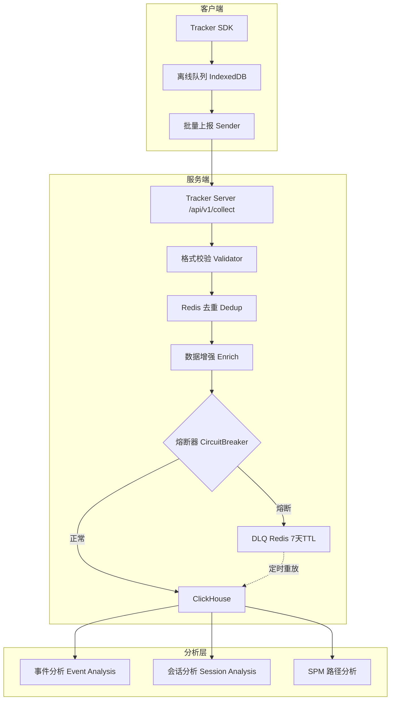

## 系统概览

Tracker System 是 GateFlow 埋点分析数据采集平台，负责全站用户行为数据的采集、处理、存储和分析。与 AB 实验系统独立部署，通过 `user_id` 在 ClickHouse 层关联。

## 采集维度

| 维度 | 核心指标 | 采集方式 |
|------|---------|---------|
| **页面级** | PV/UV、跳出率、停留时长 | SPA 路由监听、visibilitychange |
| **元素级** | 曝光率、点击率、转化漏斗 | Intersection Observer |
| **路径分析** | 页面序列、关键节点 | 会话级序列聚合 |
| **归因分析** | 渠道贡献、首次/末次触点 | UTM 参数 + 时间窗口 |

## 快速导航

::: info 提示
Tracker System 文档面向两类用户:

**产品/运营人员** → 了解埋点系统功能，学习 SPM 埋点规范，查看产品使用指南
**开发人员** → 了解系统架构设计，集成 Tracker SDK，部署运维
**团队成员** → 查阅服务地址、架构决策记录、踩坑经验等内容
:::

### 📘 产品指南

面向产品经理、运营人员、数据分析师:
- 了解埋点采集维度和能力
- 学习 SPM 四级埋点路径规范
- 掌握产品使用流程

[进入产品指南 →](/guide/)

### 💻 技术架构

面向开发工程师、运维工程师:
- 理解系统整体架构
- 掌握事件管道、数据模型设计
- 集成客户端 SDK
- 了解部署运维

[进入技术架构 →](/dev/architecture)

### 📚 内部资料

面向团队所有成员，沉淀:
- 各环境服务访问地址
- 架构决策记录 (ADR)
- 历史踩坑记录与经验
- 外部参考资料

[进入内部资料 →](/knowledge/)

